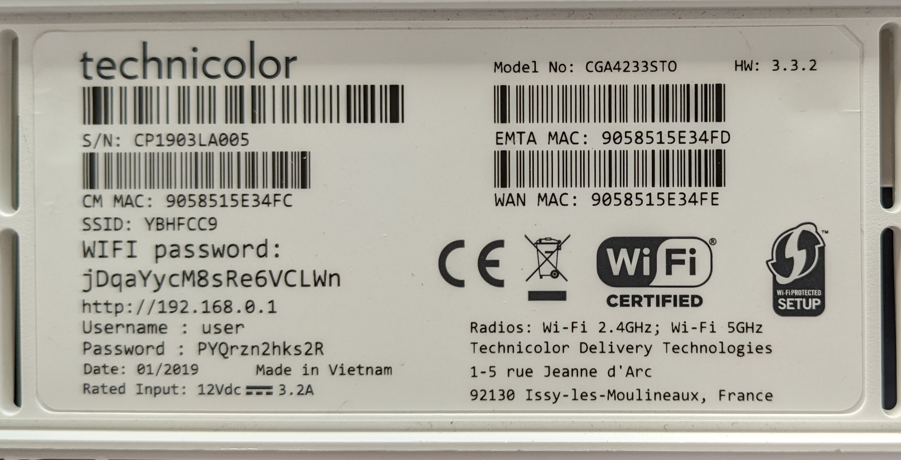

These dumps are from a Technicolor CGA4233EU. The particular device's
label these images were dumped off of is shown below:




The first NOR flash dump (`flash1.bin`) was created by desoldering the BGA chip. The other `flash1*.bin` dumps were created after getting root on the Linux part of the firmware.

The flash layout (taken from `/proc/mtd` is as follows):

```
dev:   size    erasesize  name
mtd0:  03520000 00020000 "flash1.rdknonvol"
mtd1:  00120000 00020000 "flash1.BankerTable"
mtd2:  00120000 00020000 "flash1.Stage2Update"
mtd3:  00740000 00020000 "flash1.kernel0"
mtd4:  01360000 00020000 "flash1.cm0"
mtd5:  0c5e0000 00020000 "flash1.rg0"
mtd6:  00740000 00020000 "flash1.kernel1"
mtd7:  01360000 00020000 "flash1.cm1"
mtd8:  0c5e0000 00020000 "flash1.rg1"
mtd9:  007a0000 00020000 "flash1.unused"
mtd10: 20000000 00020000 "flash1"
mtd11: 00090000 00010000 "flash0.bolt"
mtd12: 00060000 00010000 "flash0.cmnonvol1"
mtd13: 00010000 00010000 "flash0.DevProfile_RO"
mtd14: 000d0000 00010000 "flash0.SSBL_ALT"
mtd15: 00030000 00010000 "flash0.macadr"
mtd16: 00010000 00010000 "flash0.Trackers0"
mtd17: 00010000 00010000 "flash0.Trackers1"
mtd18: 00020000 00010000 "flash0.nvram"
mtd19: 00020000 00010000 "flash0.nvram1"
mtd20: 00020000 00010000 "flash0.devtree0"
mtd21: 00020000 00010000 "flash0.devtree1"
mtd22: 00060000 00010000 "flash0.cmnonvol0"
mtd23: 00010000 00010000 "flash0.DevProfile"
mtd24: 00010000 00010000 "flash0.TSFS_Exception"
mtd25: 00070000 00010000 "flash0.rgnonvol0"
mtd26: 00070000 00010000 "flash0.rgnonvol1"
mtd27: 00800000 00010000 "flash0"
```

bootlogs of the two UART consoles:

* [RG](bootlog_rg.txt) (stock)
* [RG](bootlog_rg_unlocked.txt) (unlocked)
* [CM](bootlog_cm.txt)

If you want root access to the Linux part, flash `nvram_root.bin` to both `flash0.nvram`
and `flash0.nvram1` partitions. This launches Linux with `init=/bin/sh`.

